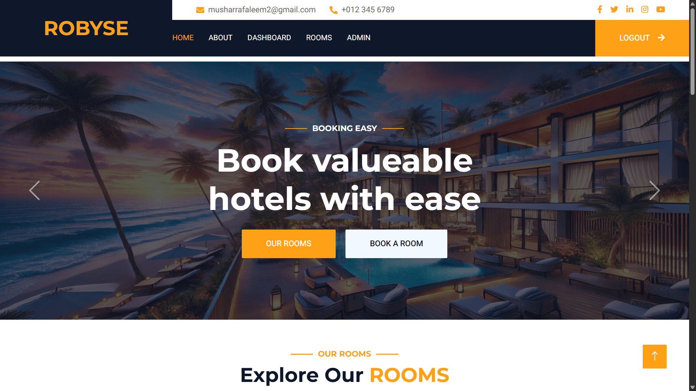
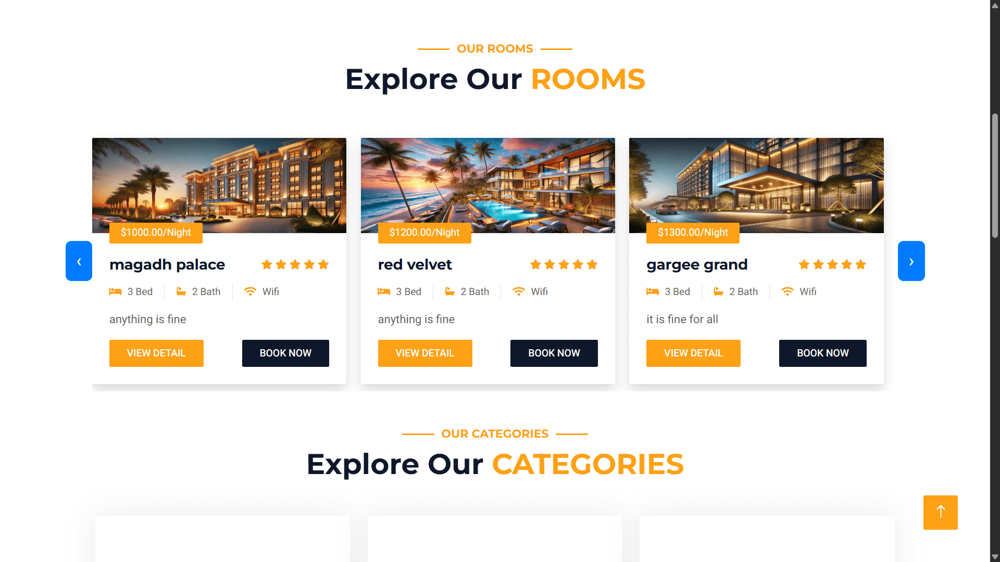
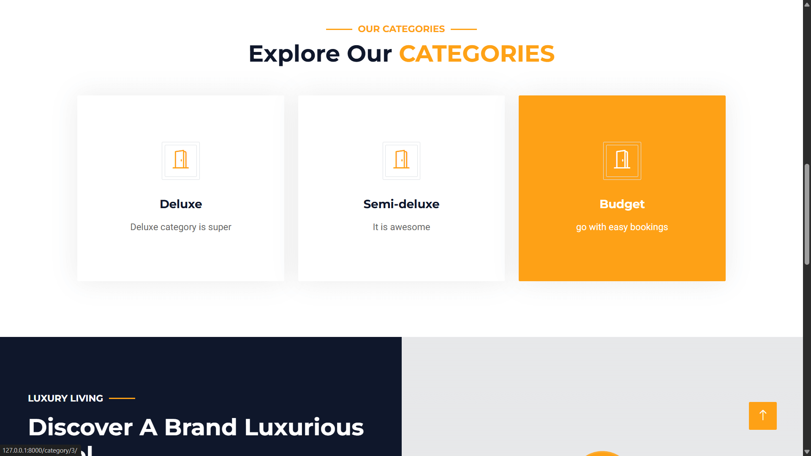
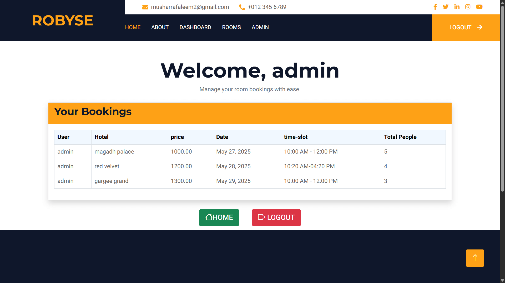
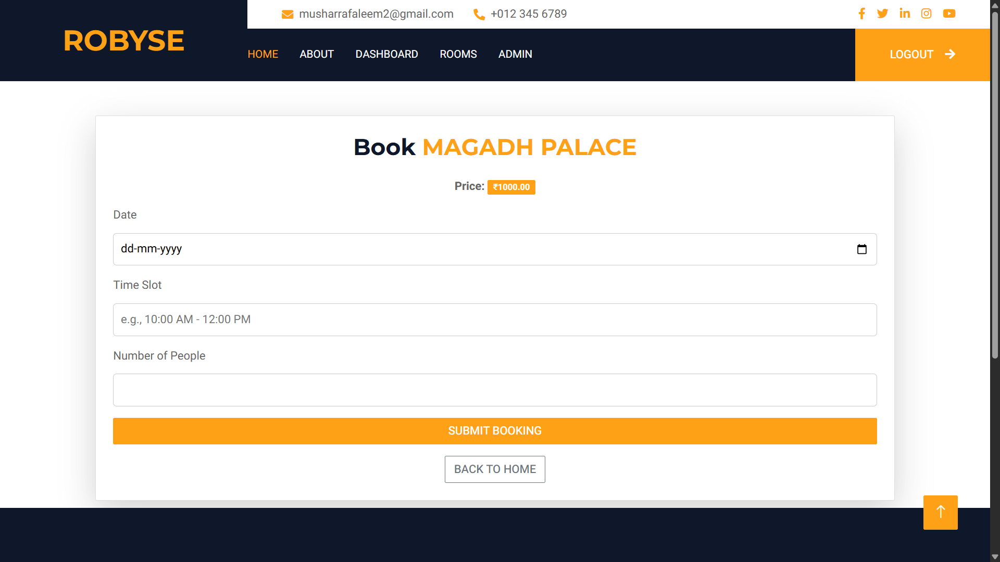
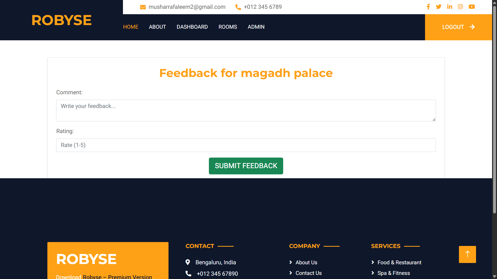
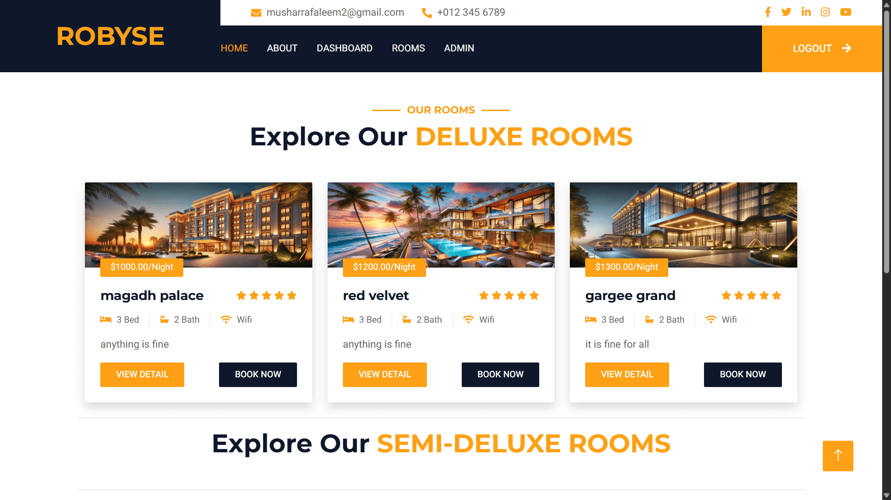
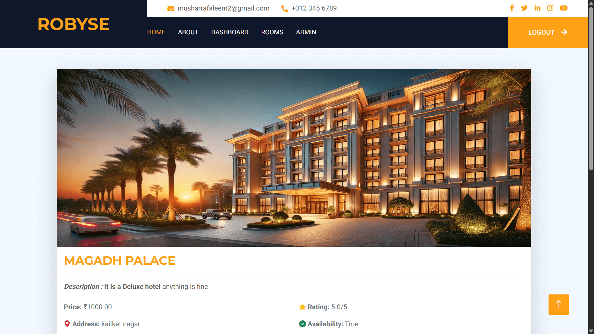
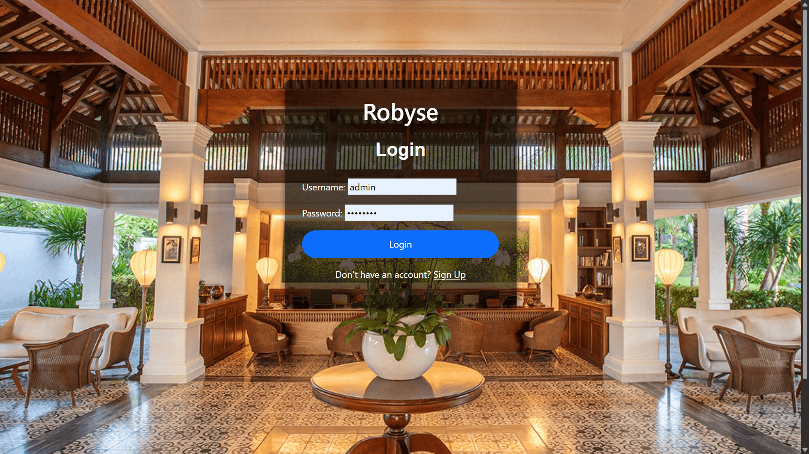
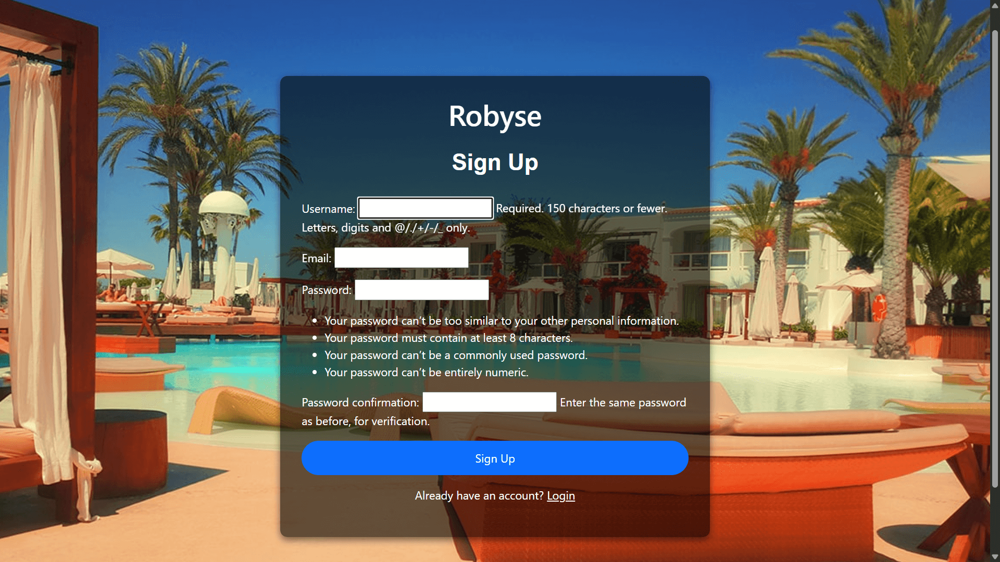

# My Django Project

Welcome to my Django-based web application! This project showcases various features such as user authentication, room booking, feedback collection, and dashboard analytics.

## 🏗 Project Overview
This web application is built using Django, with a clean and intuitive UI to help users navigate through booking, login/signup, and room details effortlessly.

## 📸 Screenshots
Here’s a preview of the different pages in the application:

### Home Page




### Dashboard


### Booking Page


### Feedback Page


### Rooms Page


### Room Detail Page


### Login & Signup Pages



## 🚀 Features
- **User Authentication** – Secure login and signup functionality
- **Booking System** – Users can book available rooms
- **Dashboard** – Displays analytics and booking data
- **Feedback Collection** – Users can submit feedback for the room
- **Room Details & Listings** – View different rooms and their details

## 🔧 Installation
1. Clone the repository:
   ```sh
   git clone https://github.com/Musharraf551/robyse.git
